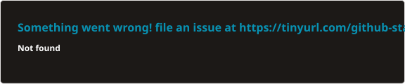

# Hi 👋 My name is Abdulaziz Alsuhaibani
## Full-Stack Developer
I'm a Full-Stack Developer with hands-on experience designing and optimizing scalable web applications and RESTful APIs. I work primarily in React.js, Python, and C#, delivering robust system integrations and seamless data flow.

- 🌍 I'm based in Riyadh, Saudi Arabia
- 💼 I'm currently a Full-Stack Developer at Grenoble Partners, building scalable web apps and REST APIs
- ☁️ AWS Certified Cloud Practitioner
- 🧠 I'm exploring Agentic AI Development with tools like Claude Code and Cursor AI
- ✉️ You can contact me at [ama.alsuhibani@gmail.com](mailto:ama.alsuhibani@gmail.com)
- 🔗 Portfolio: [abdulazizalsuhaibani.com](https://abdulazizalsuhaibani.com)
- 🤝 I'm open to collaborating on Innovative Projects

### Skills

### Socials

 <a href="https://www.github.com/ama47" target="_blank" rel="noreferrer"> <picture> <source media="(prefers-color-scheme: dark)" srcset="https://raw.githubusercontent.com/danielcranney/readme-generator/main/public/icons/socials/github-dark.svg" /> <source media="(prefers-color-scheme: light)" srcset="https://raw.githubusercontent.com/danielcranney/readme-generator/main/public/icons/socials/github.svg" />  </picture> </a> <a href="https://www.linkedin.com/in/abdulaziz-alsuhaibani-539982239" target="_blank" rel="noreferrer"> <picture> <source media="(prefers-color-scheme: dark)" srcset="https://raw.githubusercontent.com/danielcranney/readme-generator/main/public/icons/socials/linkedin-dark.svg" /> <source media="(prefers-color-scheme: light)" srcset="https://raw.githubusercontent.com/danielcranney/readme-generator/main/public/icons/socials/linkedin.svg" />  </picture> </a> <a href="https://abdulazizalsuhaibani.com" target="_blank" rel="noreferrer"> <picture> <source media="(prefers-color-scheme: dark)" srcset="./assets/social-icons/portfolio-dark.svg" /> <source media="(prefers-color-scheme: light)" srcset="./assets/social-icons/portfolio.svg" />  </picture> </a> <a href="mailto:ama.alsuhibani@gmail.com" target="_blank" rel="noreferrer"> <picture> <source media="(prefers-color-scheme: dark)" srcset="./assets/social-icons/email-dark.svg" /> <source media="(prefers-color-scheme: light)" srcset="./assets/social-icons/email.svg" />  </picture> </a>

### Badges

<b>My GitHub Stats</b>

<b>Top Repositories</b>

       

Stats cards are generated as static SVGs by [`.github/workflows/readme-stats.yml`](.github/workflows/readme-stats.yml) (daily + on demand), since the public github-readme-stats API is unreliable.
